<div align="center">

  <!-- Apple macOS Terminal Header -->
  

  <!-- Subtitle -->
  <p align="center">
    <strong>Applied AI &amp; Full-Stack Software Engineer</strong> • <strong>Creative &amp; Brand Solutions Director</strong>
    <br>
    <em>Managing Incharge @ Colorlab (8+ Years) • Creator of ColorLab Workspace, Borno for Mac, Vector Toolkit Pro &amp; DisplayFlow</em>
  </p>

  <!-- Connect / Social Badges (Apple Minimal Dark with White Icons) -->
  <p align="center">
    <a href="https://www.linkedin.com/in/yahia-mahmud-b4095b354/" target="_blank"></a>
    <a href="https://www.behance.net/yahiamahmud" target="_blank"></a>
    <a href="https://github.com/yahiabinzaman" target="_blank"></a>
    <a href="https://www.facebook.com/YahiaBinZaman" target="_blank"></a>
    <a href="https://www.instagram.com/yahiabinzaman_official/" target="_blank"></a>
    <a href="mailto:yahiamahmud10@gmail.com"></a>
  </p>

</div>

---

### Interactive Terminal Card

Run this command in any terminal to view my interactive digital card directly from GitHub:

```bash
npx github:yahiabinzaman/yahiabinzaman
```

---

### Flagship Products & Built Systems

#### 1. ColorLab Workspace (Industrial ERP & Costing OS)
* **Domain**: `Enterprise ERP` • `Full-Stack SaaS` • `Financial Ledger` • `Manufacturing Pipeline`
* **Core Capabilities**:
  * **Automated Production & Costing**: Instant diary costing engine, keyring production pipeline, and raw material pricing calculator.
  * **Layout Optimizer**: High-precision paper cutting and sheet layout optimizer for industrial offset printing.
  * **Financial Ledger & CRM**: Live cash flow management, revenue tracking, pending dues recovery, customer memos, and client database.
  * **Real-time Pipeline**: Dynamic multi-stage order tracking from design approval to delivery.

#### 2. Borno for macOS (Native Bengali Keyboard Engine)
* **Domain**: `macOS Software` • `Input Method Engine` • `Typographic Architecture`
* **Core Capabilities**:
  * **First Zero-Latency Bengali Engine for Mac**: Engineered specifically for high-speed typing with zero input delay.
  * **Dual Engine Typing**: Seamlessly writes both **Unicode & Bijoy (ANSI)** simultaneously with zero layout switching friction.
  * **Native macOS Integration**: Built to work natively across all macOS software suites (Adobe, Microsoft Office, Browsers, IDEs).

#### 3. Vector Toolkit Pro (Adobe Illustrator Automation Suite)
* **Domain**: `Automation Scripting` • `Vector Optimization` • `Prepress Engineering`
* **Core Capabilities**:
  * **Automated Alignment & Geometry**: Single-click multi-artboard auto-align, bounding box normalization, and anchor point cleanup.
  * **Prepress Color Separation**: Automated spot color management, CMYK plate verification, and plate layout generation.
  * **Batch Asset Export**: High-velocity SVG, PDF, and high-resolution print export pipelines.

#### 4. DisplayFlow (macOS Display & Workspace Manager)
* **Domain**: `macOS Utility` • `Developer Tooling` • `System Performance`
* **Core Capabilities**:
  * **Multi-Monitor Flow Control**: Rapid display resolution switching, color profile management, and workspace window snapping.
  * **Optimized for Creators**: Built specifically for designers and engineers handling color-critical displays and complex multi-window setups.

#### 5. Shop Cherlina (Modern E-Commerce Platform)
* **Domain**: `Founder` • `Next.js / React Architecture` • `Brand Identity`
* **Core Capabilities**:
  * **End-to-End Storefront**: Custom designed brand identity, modern shopping interface, and responsive product catalog.
  * **Cloud Infrastructure**: Scalable cloud database backend, order management, and fast checkout experience.

---

### Leadership & 8+ Years Industry Track Record

```typescript
interface LeadershipProfile {
  name: "Yahia Bin Zaman";
  experience: "8+ Years in Graphic Design, Industrial Prepress & Technical Leadership";
  currentPosition: "Managing Incharge @ Colorlab (Former Managing Director)";
  milestones: [
    "Architected ColorLab Workspace — an ERP managing live industrial production, costing & financial ledgers",
    "Pioneered Borno for Mac — the 1st zero-latency Bengali keyboard engine supporting Unicode & Bijoy simultaneously",
    "Engineered Vector Toolkit Pro — automating Adobe Creative Cloud workflows and cutting prepress overhead by 80%",
    "Directed enterprise brand identity, packaging, and commercial publication design for 8+ years",
    "Shipped production-ready full-stack web applications and AI agent orchestration systems"
  ];
  status: "Available for Senior Roles, AI Architecture & High-Impact Brand Consulting";
}
```

---

### The Hybrid Advantage (Why Work With Me?)

Most engineering teams suffer from a severe disconnect between creative design and software architecture. Having spent **8+ years directing brand design, prepress manufacturing, and ERP systems at Colorlab** while simultaneously engineering **native desktop software, AI agent systems, and full-stack web applications**, I deliver full-lifecycle product ownership:

* **Zero Design-Dev Bottleneck**: Pixel-perfect translation from Adobe Creative Cloud into production-grade Next.js & React code.
* **AI-Augmented Velocity**: Deploying autonomous agent pipelines and intelligent tools that 10x shipping speed.
* **End-to-End Ownership**: Concept ➔ Brand Identity ➔ Industrial ERP / Software ➔ Full-Stack Production Cloud Scale.

```
┌────────────────────────┐      ┌────────────────────────┐      ┌────────────────────────┐      ┌────────────────────────┐
│  1. Strategy & Vision  │ ──>  │ 2. Brand & Visual UI   │ ──>  │ 3. AI Agents & Backend │ ──>  │ 4. Production Scale    │
│  Leadership & Scope    │      │ Adobe Illustrator/PSD  │      │ Python, Node, Cloud DB │      │ Next.js Global Cloud   │
└────────────────────────┘      └────────────────────────┘      └────────────────────────┘      └────────────────────────┘
```

---

### Technical & Creative Capabilities

<div align="center">

#### Applied AI & Engineering
<p>
  
  
  
  
</p>

#### Frontend & Full-Stack Development
<p>
  
  
  
  
  
  
  
</p>

#### Backend, Databases & Cloud
<p>
  
  
  
  
  
  
</p>

#### Graphic Design & Total Print Solutions
<p>
  
  
  
  
  
  
</p>

#### Video Editing & Motion Graphics
<p>
  
  
  
  
</p>

#### Workflow & DevOps
<p>
  
  
  
  
  
</p>

</div>

---

### Engineering Metrics & Activity

<div align="center">

  <p align="center">
    
  </p>

  <p align="center">
    
  </p>

  <p align="center">
    
    
  </p>

</div>

---

### Portfolios & Direct Contact

<div align="center">

  <a href="https://www.behance.net/yahiamahmud" target="_blank">
    
  </a>
  <a href="https://www.linkedin.com/in/yahia-mahmud-b4095b354/" target="_blank">
    
  </a>
  <a href="https://github.com/yahiabinzaman" target="_blank">
    
  </a>
  <a href="https://www.facebook.com/YahiaBinZaman" target="_blank">
    
  </a>
  <a href="https://www.instagram.com/yahiabinzaman_official/" target="_blank">
    
  </a>
  <a href="mailto:yahiamahmud10@gmail.com">
    
  </a>

</div>

<br>

<div align="center">
  <sub>Designed &amp; Maintained by <strong>Yahia Bin Zaman</strong></sub>
</div>
